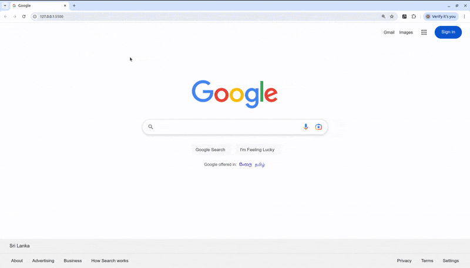
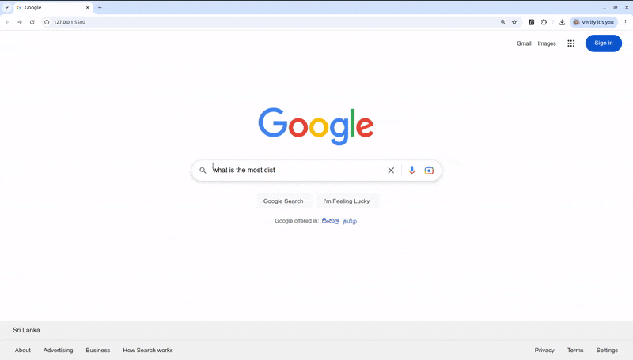
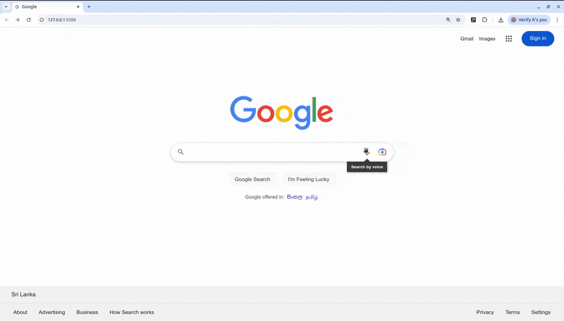

## Google Search Engine Clone

A clone of the **Google Search Engine** ([https://www.google.com/](https://www.google.com/)) built using **HTML5**, **CSS3**, and **ES6+ (vanilla JavaScript)**.

### Features

- **Responsive Design:**  
  The website is made responsive using the **Flexible Box (flexbox)** layout.
  
- **Google Apps Popup:**  
  The Google Apps popup window displays the apps arranged as **inline-block elements** in a normal flow layout.

- **Dark and Light Mode Toggle:**  
  A toggle between **dark** and **light mode** has been implemented for an enhanced user experience.

- **Google Web Services Integration:**  
  Utilizes **Google Web Services** for:
  - Search functionalities, including **search by text, image, and voice.**
  - **Language management,** with the ability to convert between **English**, **සිංහල**, and **தமிழ்**.
  - **Navigating through Google Apps.**
  - **Sign-in process and settings configuration.**
  - Additional functionalities powered by **Google Web Services**.

### Technologies Used

- **HTML5**
- **CSS3**
- **ES6+ (vanilla JavaScript)**
- **Google Web Services**

### Preview

  

  

